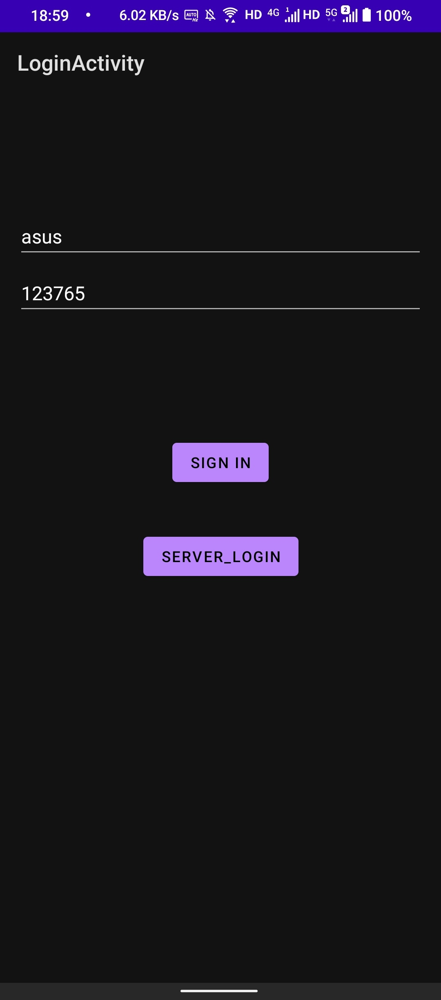
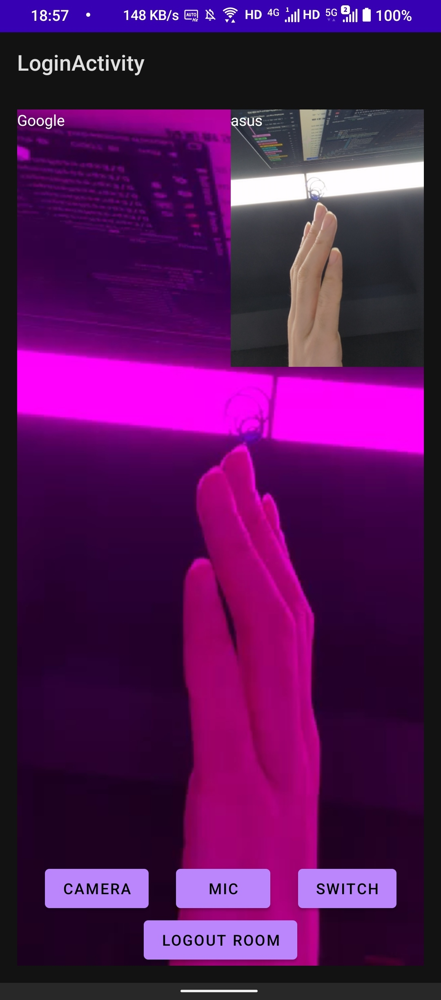

Please test with two devices:

1. One device clicks login
2. A device hits serverLogin, which triggers an additional call to `ExpressManager.getInstance().enableMirrorARServerLogic();`

Logic description of enableMirrorARServerLogic: In `enableMirrorARServerLogic`, we get the raw data of the remote stream, and set the green component of the RGBA format data to 0 pixel by pixel, and send it out.

> Note that in the test demo,, after logging in as server, this device cannot switch to normal user mode during this run.

The effect is as follows:

